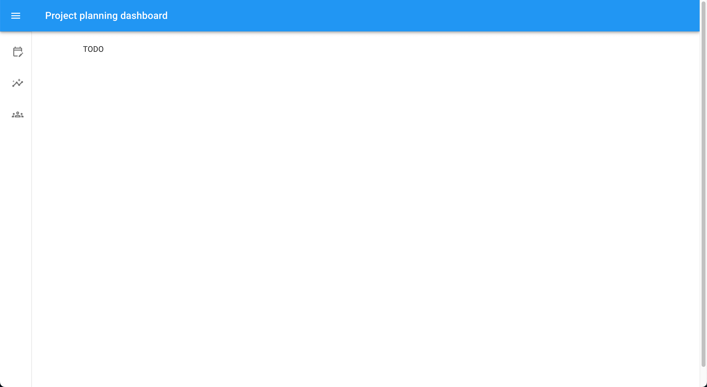

# Using Bryntum Gantt and Bryntum Scheduler with React and Material UI components

This [Material UI (MUI)](https://mui.com/) project was generated using the [MUI Vite.js with TypeScript example project](https://github.com/mui/material-ui/tree/master/examples/material-ui-vite-ts).

It has an added [navigation drawer](https://mui.com/material-ui/react-drawer/) with three pages: 

- Project planning
- Analytics
- Clients

[React router](https://reactrouter.com/en/main) is used for navigation.

## Getting started

Install the dependencies by running the following command: 

```sh
npm install
```

## Running the app

Run the local dev server:

```sh
npm run dev
```

Open `http://localhost:5173/` to see the template MUI app:


